## About the connector
Atlassian has developed Jira as a proprietary issue tracking product. Jira provides bug tracking, issue tracking, and project management functions. 

This document provides information about the Jira connector, which facilitates automated interactions, with a Jira server using CyOPs™ playbooks. Add the Jira connector as a step in CyOPs™ playbooks and perform automated operations, such as automatically creating a Jira tickets and retrieving the status of an issue.

### Version information
Connector Version: 1.0.0

Compatibility with CyOPs™ Versions: 4.10.3-161 and later

Compatibility with Jira Versions: 2.1 and later

## Installing the connector

All connectors provided by  CyOPs™ are delivered using a CyOPs™ repository. Therefore, you must set up your CyOPs™ repository and use the `yum` command to install connectors:

`yum install cyops-connector-jira`

To update a  CyOPs™-provided connector use the following command:

`yum update cyops-connector-jira`

To remove a  CyOPs™-provided connector use the following command:

`yum remove cyops-connector-jira`

The process to write your own custom connector is defined in the `Building a custom connector` topic.

## Prerequisites to configuring the connector

- You must have the URL and credentials to access a Jira server from where the connector will gets notifications. You must also have the credentials of a user, who has a right to configure WebHooks on the Jira server.  
- You must configure and enable the Jira WebHook. See the [Configuring the Jira WebHook](#Configuring-the-Jira-WebHook) section. 
- To access the CyOPs™ UI, ensure that port 443 is open through the firewall for the CyOPs™ instance.

## Configuring the connector

!!! Note  
		This procedure assumes that you are using CyOPs™ version 4.10.3. If you are using a different version of CyOPs™, such as CyOPs™ 4.9, then it is possible that the CyOPs™ UI navigation is different. Refer to the CyOPs™ documentation of that particular version for details about CyOPs™ navigation.

1. In CyOPs™, on the left pane, click **Automation** > **Connectors**.   
   On the `Connectors` page, you will see the `Jira` connector.
2. To configure the connector parameters, click the Jira connector row to open the **Configurations** tab. Enter the required configuration details in the **Configurations** tab.   
   You must provide a name for you configuration and you can optionally check the **Mark As Default Configuration** checkbox to make Jira connector point to this configuration by default.  
   You must provide configuration parameters such as the URL of the Jira server from where the connector gets notifications and the username and password configured for your account to access that server.  
   For a complete list of configuration parameters, see the [Configuration parameters](#Configuration-parameters) section.  
   **Note**: You can add multiple configurations if you have more than one Jira server instances in your environment. You must, therefore, specify a unique `Name` to identify each configuration in your environment.  
   If you have previous versions of a connector and you are configuring a newer version of that connector, with the same configuration parameters, then CyOPs™ fetches the configuration and input parameters of the latest available version of that connector. For example, If you have 1.0.0, 1.1.0, 1.2.0, and 1.3.0 versions of the Jira connector and you are configuring the 1.4.0 version of the Jira connector, then while configuring the 1.4.0 version,  CyOPs™ will fetch the configuration and input parameters from the 1.3.0 version of the Jira connector. You can review the configuration and input parameters, and then decide to change them or leave them unchanged. 
3. To save your configuration, click **Save**.  
   To view the list of actions that can be performed by the connector, click the **Actions** tab.  
   To view the playbook file that is bundled with the connector, click the **Playbooks** tab. Refer to the [Included Playbooks](#Included-playbooks) section for details on the bundled playbooks. You can see the bundled playbooks by clicking on the **Sample - Jira - 1.0.0** link after importing the Jira connector.   
   You can also see the bundled playbooks in the **Automation** > **Playbooks** section in CyOPs™ after importing the Jira connector.  
   Once you click **Save** the Jira connector performs a health check.
4. (Optional) You can also perform the health check and check the connectivity to the Jira server and validity of the credentials provided anytime, by clicking the **Refresh** icon that is present in the `Health Check` bar.   
   If all the details are correct and the connectivity to the Jira server is established then on the `Connectors` page, **Available** is displayed in the health check dialog.  
   If any or all the details are incorrect or if the connectivity to the Jira server cannot be established then on the `Connectors` page, **Disconnected** is displayed in the health check dialog.

### Configuration parameters

In CyOPs™, on the Connectors page, select the **Jira** connector and click **Configure** to configure the following parameters:

| Parameter  | Description                                                  |
| ---------- | ------------------------------------------------------------ |
| Server URL | URL for the Jira server from where the connector gets notifications. |
| Username   | Username configured for your account to access the Jira server from where the connector gets notifications. |
| Password   | Password configured for your account to access the Jira server from where the connector gets notifications. |
| Verify SSL | Specifies whether the SSL certificate for the server is to be verified or not.  Defaults to `True`. |

## Configuring the Jira WebHook

On the Jira server where the connector connects, enable the `Get Notification from Jira ` WebHook, so that Jira can forward activities to CyOPs™. The Jira WebHook pushes configured activities to CyOPs™.

**Note**: Refer to Jira documentation for the detailed procedure for adding and enabling WebHooks.

1. To enable the `Get Notification from Jira` WebHook:
2. Open the Jira server where you have connected the Jira connector.
3. To add a WebHook, click **Settings** > **System** > **Advanced** > **WebHooks** > **Add WebHooks**.
4. In the URL field, enter the `CyOPs™ Playbooks API Trigger URL` of the server for the WebHook.  
   URLs are in the format: `<IP Address of the CyOPs instance>/api/triggers/1/deferred/<name of the action trigger given by the user>`
5. Ensure that the Status is **Enabled**.
6. Configure other parameters as required.
7. Click **Save**.

The following image displays a configured Jira WebHook:

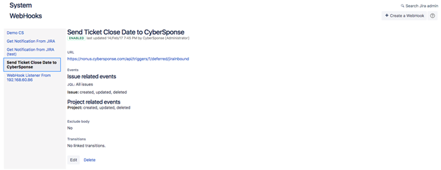

## Actions supported by the connector

The following automated operations can be included in playbooks and you can also use the annotations to access operations from CyOPs™ release 4.10.0 onwards:

| Function               | Description                                                  | Annotation and Category                     |
| ---------------------- | ------------------------------------------------------------ | ------------------------------------------- |
| Create Ticket          | Creates a Jira ticket on your configured Jira server.        | create_ticket   Investigation          |
| Get Ticket Information | Retrieves details for a particular Jira ticket from the Jira server, based on the ticket key you have specified. | get_ticket_information   Investigation |
| List Projects          | Retrieves a list and details of all projects from your configured Jira server. | list_projects   Investigation          |
| List Tickets           | Retrieves a list and details of tickets associated with a project from your configured Jira server, based on the project key you have specified. | list_tickets   Investigation           |
| Add Comment            | Adds a comment to an existing Jira ticket on your configured Jira server. | add_comments   Investigation           |
| Set Ticket Status      | Updates the status of an existing Jira ticket on your configured Jira server. | set_status   Investigation             |
| Update Ticket          | Updates an existing Jira ticket on your configured Jira server, based on the input parameters you have specified. | update_ticket   Investigation          |
| Update CyOPs Record    | Updates a CyOps record with information of an existing Jira ticket. | update_cyops_record   Investigation    |
| Delete Ticket          | Deletes a ticket from your configured Jira server, based on the ticket key you have specified. | delete_ticket  Investigation           |

### operation: Create Ticket
#### Input parameters

For information on the Create issue method, see [https://docs.atlassian.com/software/jira/docs/api/REST/7.1.0-m01/#api/2/issue-createIssue](https://docs.atlassian.com/software/jira/docs/api/REST/7.1.0-m01/#api/2/issue-createIssue).

| Parameter          | Description                                                  |
| ------------------ | ------------------------------------------------------------ |
| Project Key        | Unique project ID that represents the project under which you want to create the Jira ticket. |
| Ticket Summary     | Summary or heading of the ticket that you want to create on your configured Jira server. |
| Ticket Description | Description of the ticket that you want to create on your configured Jira server. |
| Ticket Type        | Type of ticket that you want to create on your configured Jira server.   You can add one of the following ticket types: IT Help, Service Request, Service Request with Approvals, Task, or Sub-task. |
| Priority           | (Optional) Priority that you want to set for the Jira ticket that you want to update on your configured Jira server.    You can add one of the following priorities: Highest, High, Medium, Low, or Lowest. |
| Other Fields       | (Optional) Fields such as Reporter, Assignee, Components that you need to set while creating a ticket.   For example: `{"reporter": {"name":"admin"}, "assignee":{"name":"admin"}, "components":[{"name":"Intranet"}]} ` |
#### Output

The JSON output contains the ID of the Jira ticket created on your configured Jira server.  

Following image displays a sample output:

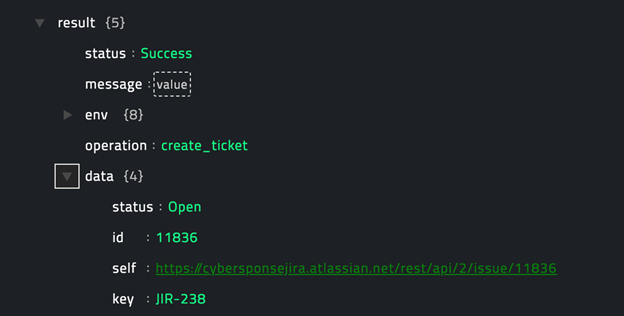

### operation: Get Ticket Information 

#### Input parameters

| Parameter  | Description                                                  |
| ---------- | ------------------------------------------------------------ |
| Ticket Key | Unique ID that is created for each ticket. Enter the ticket key whose information you want to retrieve from your configured Jira server.   You can enter the ticket key directly, such as `JIR-000` or use Dynamic Variables in this field and enter the ticket key in the format `{{vars.result.data.key}}`. |

#### Output

A JSON output contains the details of the ticket, including the updated status of the Jira ticket, retrieved from your configured Jira server, based on the ticket key that you have specified. 

Following image displays a sample output:

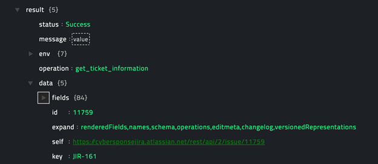

### operation: List Projects

#### Input parameters

None

#### Output

A JSON output contains a list and details of all projects retrieved from your configured Jira server 

Following image displays a sample output:

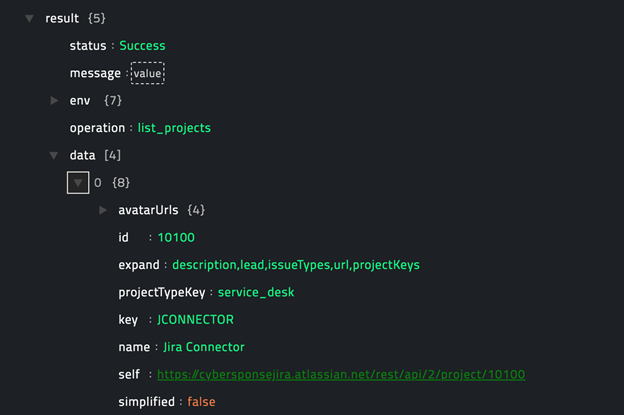

### operation: List Tickets 

#### Input parameters

For information on the searching for Jira issues, see [https://developer.atlassian.com/server/jira/platform/jira-rest-api-examples/#searching-for-issues-examples](https://developer.atlassian.com/server/jira/platform/jira-rest-api-examples/#searching-for-issues-examples) and [https://confluence.atlassian.com/jiracore/blog/2015/07/search-jira-like-a-boss-with-jql](https://confluence.atlassian.com/jiracore/blog/2015/07/search-jira-like-a-boss-with-jql).

| Parameter                    | Description                                                  |
| ---------------------------- | ------------------------------------------------------------ |
| Project Key                  | Unique project ID that represents the project for which you want to retrieve the list and details of Jira tickets from your configured Jira server. |
| Start At                     | (Optional) Starting index for retrieving tickets from Jira.   By default this it set to **0**. |
| Max Results                  | (Optional) Maximum number of tickets that this operation should return.  By default this it set to **50**. |
| Status                       | (Optional) Status based on which you want to retrieve the list and details of Jira tickets.    You can add statuses such as, Pending, Back to open, Mark as Done, Start progress, or Reopen issue. |
| Additional Search Parameters | (Optional) Additional search parameters, such as Reporter, Priority, and Issue Type, based on which you want to retrieve the list and details of Jira tickets.   For example, `{"priority":"Medium","reporter":"admin"}`. |
| Fields                       | (Optional) Fields such as, Id, Key, Status, Priority, and Reporter are different types of information in the system that you can choose to be included and displayed in the output.  For example: `["id","key","status","priority"]`. |

#### Output

A JSON output contains a list and details of tickets associated with a project retrieved from your configured Jira server, based on the project key you have specified. 

Following image displays a sample output:

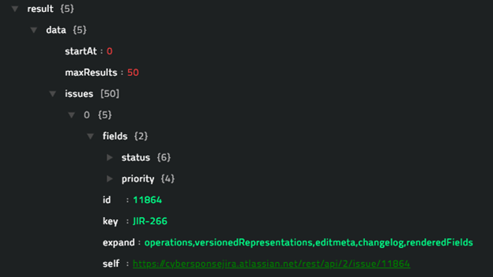

### operation: Add Comment

#### Input parameters

| Parameter  | Description                                                  |
| ---------- | ------------------------------------------------------------ |
| Ticket Key | Unique ID that is created for each ticket. Enter the ticket key for the Jira ticket to which you want to add a comment.  You can enter the ticket key directly, such as `JIR-000` or use Dynamic Variables in this field and enter the ticket key in the format `{{vars.result.data.key}}`. |
| Comment    | Comment that you want to add to an existing Jira ticket.     |

#### Output

A JSON output contains the details of the ticket, including the comment that you have added to the Jira ticket, retrieved from your configured Jira server, based on the ticket key that you have specified.

Following image displays a sample output: 

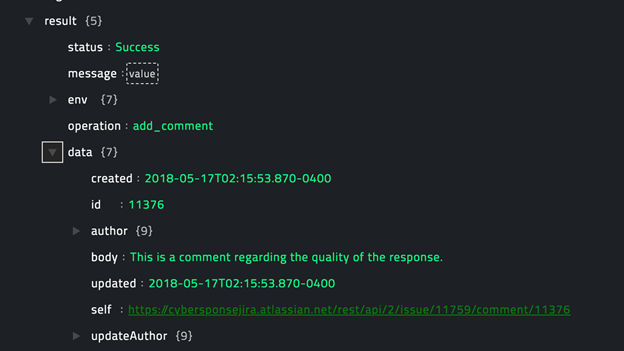

### operation: Set Ticket Status

#### Input parameters

| Parameter  | Description                                                  |
| ---------- | ------------------------------------------------------------ |
| Ticket | Unique ID that is created for each ticket. Enter the ticket key for the Jira ticket whose status you want to set.  You can enter the ticket key directly, such as `JIR-000` or use Dynamic Variables in this field and enter the ticket key in the format `{{vars.result.data.key}}`. |
| Status | Status that you want to set for an existing Jira ticket.   You can add statuses such as, Pending, Back to open, Mark as Done, Start progress, or Reopen issue. |

#### Output

The JSON output returns a `Success` message if the status that you have specified is successfully updated for the Jira ticket that you have specified on your configured Jira server.

Following image displays a sample output: 

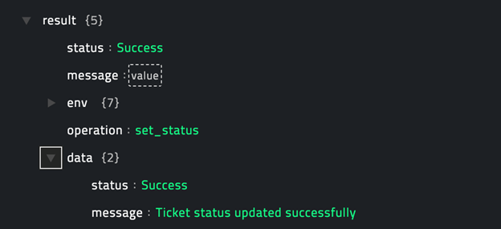

### operation: Update Ticket

For information on the Edit issue method, see [https://docs.atlassian.com/software/jira/docs/api/REST/7.1.0-m01/#api/2/issue-editIssue](https://docs.atlassian.com/software/jira/docs/api/REST/7.1.0-m01/#api/2/issue-editIssue).

#### Input parameters

| Parameter    | Description                                                  |
| ------------ | ------------------------------------------------------------ |
| Ticket       | Unique ID that is created for each ticket. Enter the ticket key that you want to update on your configured Jira server.   You can enter the ticket key directly, such as `JIR-000` or use Dynamic Variables in this field and enter the ticket key in the format `{{vars.result.data.key}}`. |
| Project Key  | Unique project ID that represents the project that contains the Jira ticket that you want to update on your configured Jira server. |
| Summary      | Summary or heading of the Jira ticket that you want to update on your configured Jira server. |
| Comment      | Comment that you want to add to the Jira ticket when you are updating the Jira ticket on your configured Jira server. |
| Priority     | Priority that you want to set for the Jira ticket that you want to update on your configured Jira server.    You can add one of the following priorities: Highest, High, Medium, Low, or Lowest. |
| Description  | (Optional) Description that you want to add to the Jira ticket when you are updating the Jira ticket on your configured Jira server. |
| Status       | (Optional) Status that you want to set to the Jira ticket when you are updating the Jira ticket on your configured Jira server.   You can add statuses such as, Pending, Back to open, Mark as Done, Start progress, or Reopen issue. |
| Other Fields | (Optional) Fields such as Reporter, Assignee, Components that you need to set while updating a ticket.   For example: `{"components":[{"name":"JIRA"}]}` |

#### Output

The JSON output returns a `Success` message if the Jira ticket that you have specified is successfully updated on your configured Jira server.

Following image displays a sample output: 

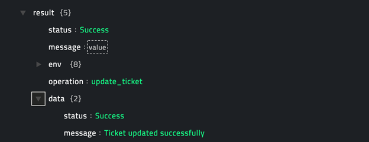

### operation: Update CyOPs Record

#### Input parameters

| Parameter  | Description                                                  |
| ---------- | ------------------------------------------------------------ |
| Ticket Key | Unique ID that is created for each ticket. Enter the ticket key for the Jira ticket that you want to update in CyOPs™.  You can enter the ticket key directly, such as `JIR-000` or use Dynamic Variables in this field and enter the ticket key in the format `{{vars.result.data.key}}`. |
| CyOps Username | Username configured for the CyOPs™ instance where you want to update the Jira ticket. |
| CyOps Password | Password configured for the CyOPs™ instance where you want to update the Jira ticket. |

#### Output

The JSON output contains the fields of the Incident record in CyOPs™ which is updated with the Jira ticket details.

Following image displays a sample output: 

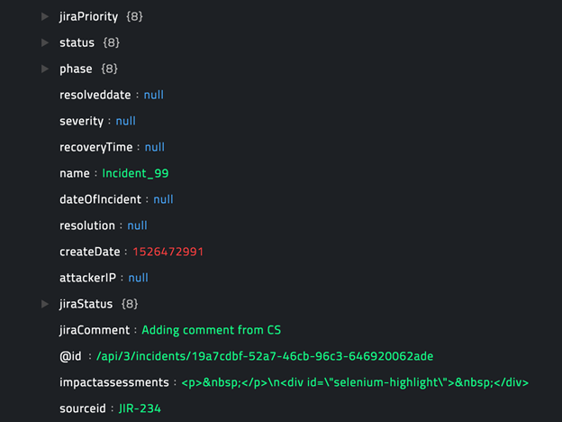

### operation: Delete Ticket

#### Input parameters

| Parameter  | Description                                                  |
| ---------- | ------------------------------------------------------------ |
| Ticket Key | Unique ID that is created for each ticket. Enter the ticket key for the Jira ticket that you want to delete from your configured Jira server. You can enter the ticket key directly, such as `JIR-000` or use Dynamic Variables in this field and enter the ticket key in the format `{{vars.result.data.key}}`. |
| Delete Subtasks | Select this option, i.e., set it to true to delete subtasks associated with the Jira ticket. If the ticket has subtasks then you must select this option so that the ticket can be successfully deleted from your configured Jira server. |

#### Output

The JSON output returns a `Success` message if the Jira ticket that you have specified is successfully deleted from your configured Jira server.

Following image displays a sample output: 

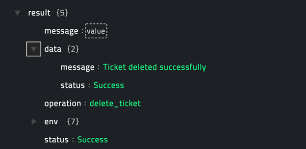

## Included playbooks

The `Sample - Jira - 1.0.0`  playbook collection comes bundled with the Jira connector. This playbook contains steps using which you can perform all supported actions. You can see the bundled playbooks in the **Automation** > **Playbooks** section in CyOPs™ after importing the Jira connector.

- Add Comment
- Create Ticket
- Delete Ticket
- Get Ticket Information
- List Projects
- List Tickets
- Set Ticket Status
- Update CyOPs Record  
  **Prerequisite**: Update CyOPs™ modules. See the [Updating the CyOPs™ Modules](#Updating-the-CyOPs-Modules) section.  
- Update Ticket  
  **Prerequisite**: Update CyOPs™ modules. See the [Updating the CyOPs™ Modules](#Updating-the-CyOPs-Modules) section.  

**Note**: If you are planning to use any of the sample playbooks in your environment, ensure that you clone those playbooks and move them to a different collection, since the sample playbook collection gets deleted during connector upgrade and delete.

## Updating the CyOPs™ Modules

!!! Note  
		This procedure is optional, and it enables bidirectional update of Jira tickets and you must perform this procedure for the **Update CyOPs Record** and **Update Ticket** playbooks to work correctly. 

This procedure also assumes that you are using CyOPs™ version 4.10.3. If you are using a different version of CyOPs™, such as CyOPs™ 4.9, then it is possible that the CyOPs™ UI navigation is different. Refer to the CyOPs™ documentation of that particular version for details about CyOPs™ navigation.

When a Jira ticket is mapped to a CyOPs™ incident, the `Priority` and `Status` of the Jira ticket can be mapped into the equivalent fields in the CyOPs™ modules. Perform the following steps to add the `JiraPriority` and  `JiraStatus` fields to the CyOPs™ `Incidents` module:

1. Log on to CyOPs™ as an administrator.
2. Open the `Picklist Editor` and create a picklist named `JiraPriority`. To open the Picklist Editor, click **Settings** and in the `Application Editor` section, and click **Picklists**:
    1. On the `Picklists` page, in the **Title** field, type `JiraPriority`.   
    2. Add **priorities** in the following order: **Highest**, **High**, **Medium**, **Low** and **Lowest**.
    3. (Optional) Clear the **Assign colors** checkbox, if it is checked.  
      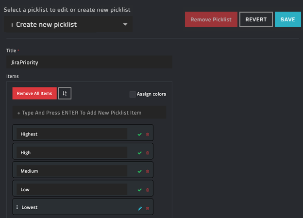
    4. Click **Save**.
3. Create another picklist named `JiraStatus` as follows:
    1. In the **Title** field, type `JiraStatus`.
    2. Add statuses in the following order: **Pending**, **Start progress**, **Mark as Done**, **Back to open**, **Reopen issue**, **Respond to customer**, **Resolve this issue**, **Escalate this issue**, **Cancel request**, **In progress**, **Escalate**, **Back to in progress**, **Close**, **Respond to support**, and **Waiting for approval**.
    3. (Optional) Clear the **Assign colors** checkbox, if it is checked.    
      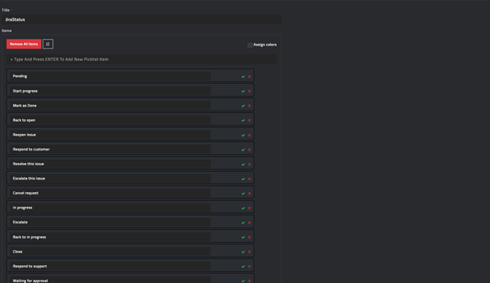
    4. Click **Save**.  
4. Update the `Incidents` Module as follows:  
    **Important**: For bidirectional updates to work you must map the **JiraPriority** and **JiraStatus** fields.
    1. Open the `Module Editor` by clicking **Settings** and then click **Modules** in the `Application Editor` section. 
    2. On the `Modules` page, from the **Select a module to edit or create a new module** drop-down list, select **Incidents**.
    3. Click the **Fields Editor** tab.
    4. To add the **JiraPriority** picklist to the `Incidents` module, click the **+** (Add Field) icon and add a new field with the following properties:  
          In the Field Type field, select **Picklist**.  
          From the **Picklist** drop-down list, select **JiraPriority**.  
          In the **Name** field, type `jiraPriority`.  
          In the **Singular Name** field, type `Jira Priority`.  
          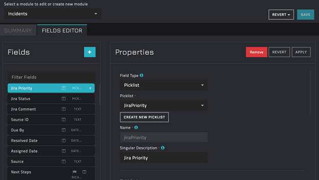  
          Click **Apply**.
    5. To add the **JiraStatus** picklist to the `Incidents` module, click the **+** (Add Field) icon and add a new field with the following properties:  
          In the Field Type field, select **Picklist**.  
          From the **Picklist** drop-down list, select **JiraStatus**.  
          In the **Name** field, type `jiraStatus`.  
          In the **Singular Name** field, type `Jira Status`.  
          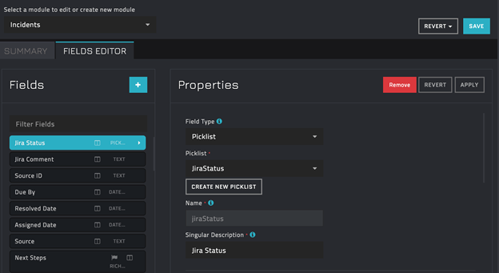 
          Click **Apply** and **Save**.
5. Once you have completed updating all the CyOPs™ modules, you must publish the module to enforce the changes. Click **Publish All Modules** and click **OK** to publish the modules.

